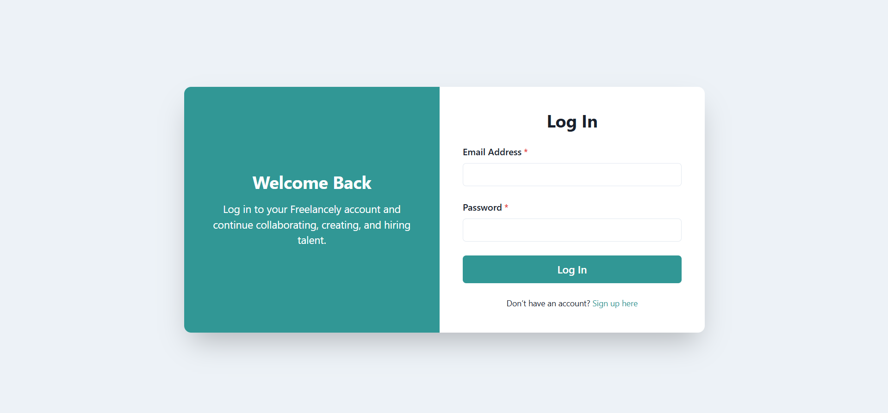
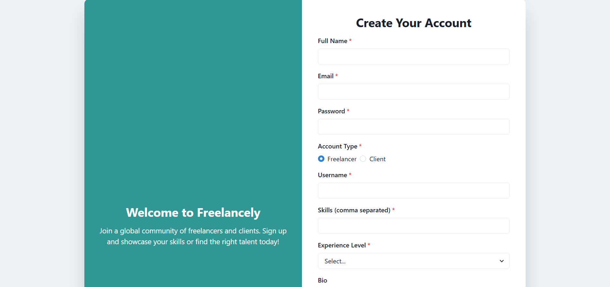
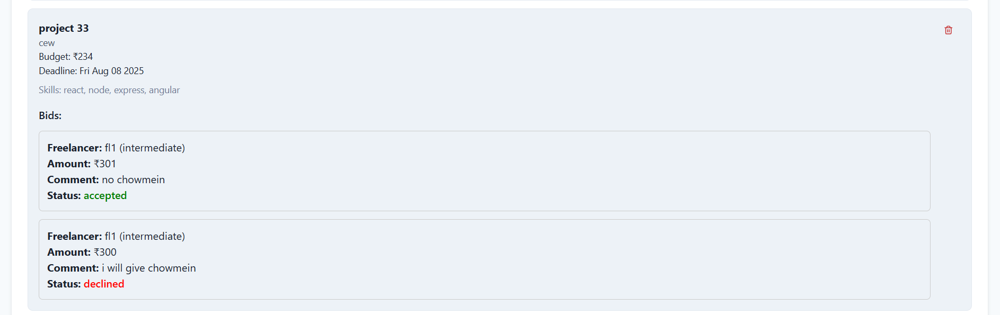
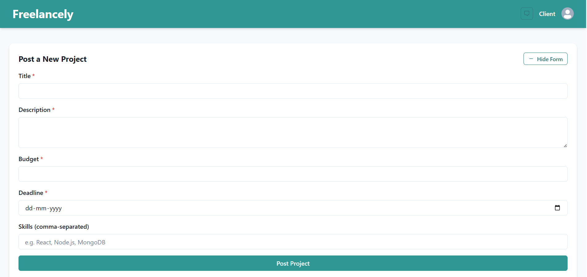
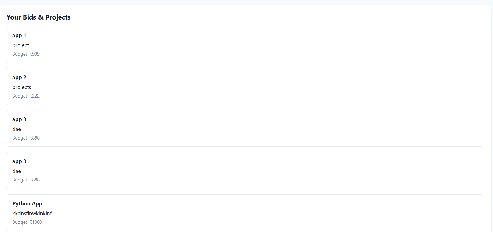
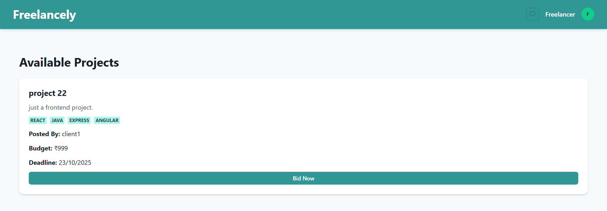
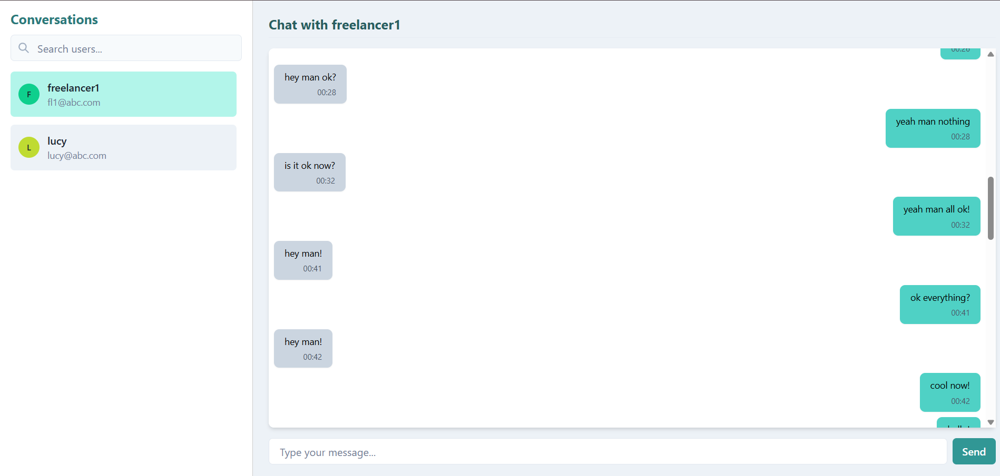

# Freelancely - Collaborative Freelance Marketplace

Freelancely is a real-time collaborative platform for freelancers and clients, built with the MERN stack and Socket.io. Clients can post projects, manage bids, and communicate with freelancers. Freelancers can browse projects, place bids, and interact with clients. The platform works entirely in real-time.

---

## Features

**For Clients**
- Post new projects with detailed descriptions
- Accept or reject bids from freelancers
- Receive real-time updates on project activity and bids
- Chat directly with freelancers

**For Freelancers**
- Browse available projects
- Place bids on projects
- Track the status of submitted bids
- Chat with clients in real-time

**General**
- Fully real-time platform powered by Socket.io
- Responsive and modern UI
- Secure authentication using JWT

---

## Tech Stack
- Frontend: React.js
- Backend: Node.js, Express.js
- Database: MongoDB
- Real-time Communication: Socket.io
- Authentication: JWT

---

## Installation

Clone the repository:  
`git clone https://github.com/lakshyakumar004/freelance-marketplace-freelancely.git`

Install backend dependencies:  
`cd backend`  
`npm install`

Install frontend dependencies:  
`cd ../frontend`  
`npm install`

Create a `.env` file in the `backend` folder with the following content:  
`MONGO_URI=your_mongodb_connection_string`  
`JWT_SECRET=your_jwt_secret`

Run backend server:  
`cd backend`  
`npm start`

Run frontend server:  
`cd frontend`  
`npm start`

---

## Usage

- Clients: Sign up, create projects, manage bids, and chat with freelancers  
- Freelancers: Sign up, browse projects, place bids, and chat with clients  
- Real-time updates ensure a smooth collaborative experience

---

## Screenshots

### Authentication
**Login**  
  
**Sign Up**  

### Client Dashboard
**Client Projects**  
  
**Post Project**  

### Freelancer Dashboard
**Freelancer Projects**  
  
**Post Bid**  

### Messaging Feature

---

## Contributing

Fork the repository, create a branch, commit your changes, push to the branch, and open a Pull Request.

---

## Contact

**Lakshya Kumar**  
GitHub: [lakshyakumar004](https://github.com/lakshyakumar004)  
